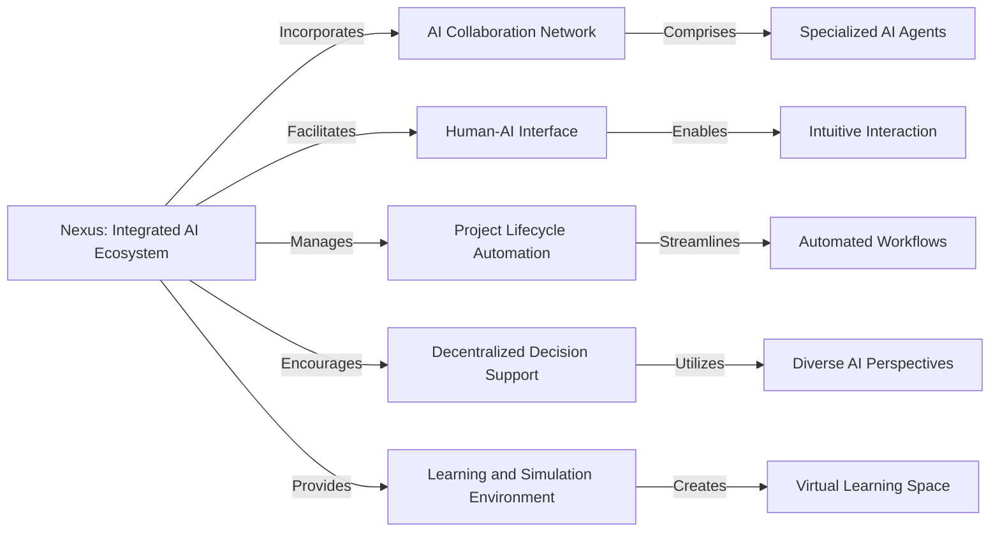
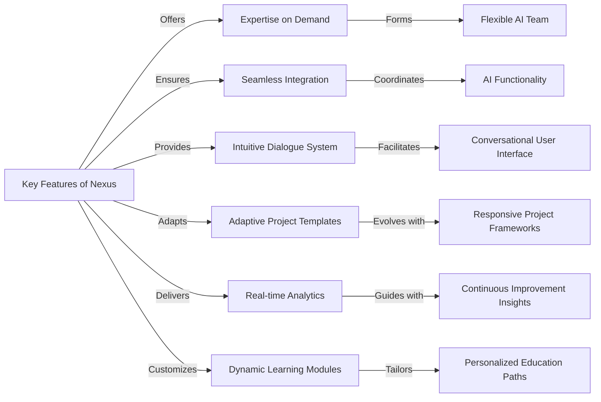
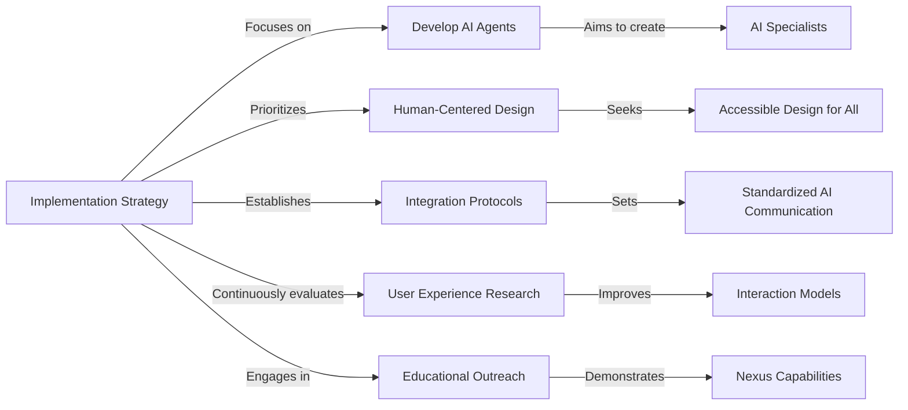
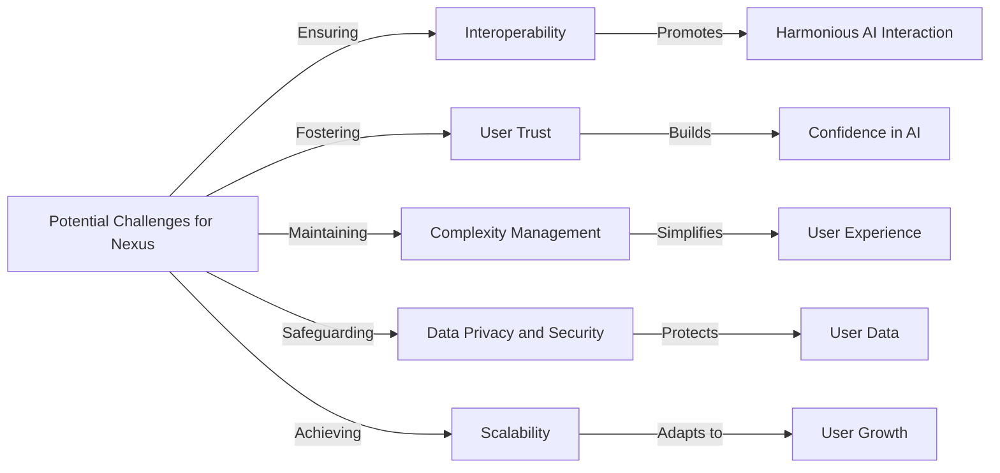

# The Problem

Current AI systems often operate in isolation, each designed to perform specific tasks without the ability to collaborate or understand context beyond their programmed capabilities. This leads to a disjointed experience where users must manually bridge the gap between different AI tools, integrate data, and interpret results to apply them effectively in real-world scenarios.

# Nexus

Imagine Nexus as a platform where AI agents with distinct abilities team up with humans. It's a space where AI actively participates in creative and decision-making processes, and humans steer these towards meaningful outcomes. This ecosystem enables a symbiotic relationship where AI contributes to creative processes, decision-making, and problem-solving, while humans guide and refine the outcomes based on their goals and values.

## **Core Components**

- **AI Collaboration Network** consisting of specialized AI agents.
- **Human-AI Interface** allowing intuitive interaction with AI.
- **Project Lifecycle Automation** for guiding projects from start to finish.
- **Decentralized Decision Support** to enable diverse input for better results.
- **Learning and Simulation Environment** for hands-on skill-building and testing.



## **Key Features**

- Access to a range of AI expertise as needed.
- Smooth integration of AI agents for a cohesive team effort.
- Conversational interface for natural communication with AI.
- Project templates that adapt and learn from user interaction.
- Continuous project analytics with AI-driven suggestions.
- Customized learning experiences tailored by AI to individual users.



## **Implementation Strategy**

- Create a lineup of AI specialists.
- Design with a focus on user needs across various backgrounds.
- Set up communication standards for AI agents.
- Engage in ongoing user experience research and refinement.
- Launch educational programs to showcase Nexus’s capabilities.



## **Potential Challenges**

- Ensuring AI agents can work in harmony.
- Fostering user trust in the AI's contributions.
- Maintaining simplicity for the user despite complex backend operations.
- Safeguarding user data privacy and security.
- Scaling the platform for growing user numbers and project demands.



        Have fun!", create a new line with “—-“and then type: -
        
        " Enter the **name** or **names** of the **social networks** you want to upload to. Then enter the **goal** for that **social network** and write how many **days** you want to upload the content. Finally, please give me the **topic** of your** profile**, what it will be based on, and what it will post. Good luck!"```
