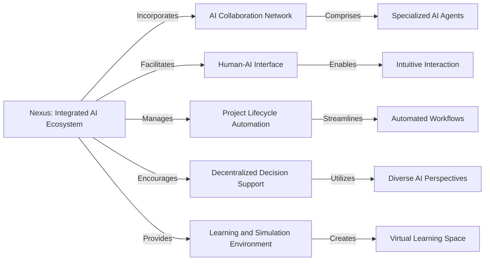
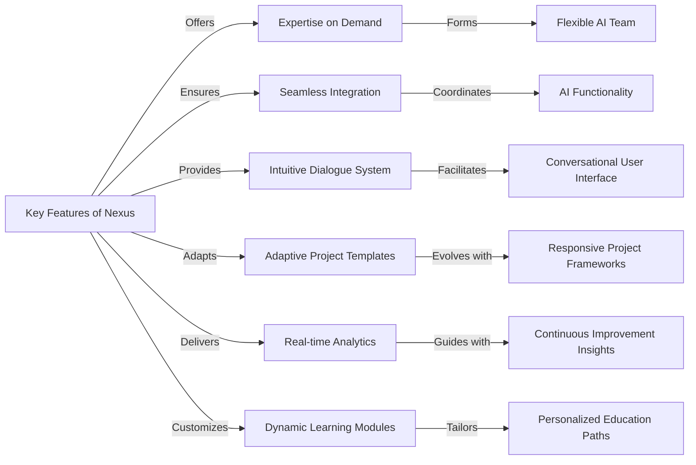
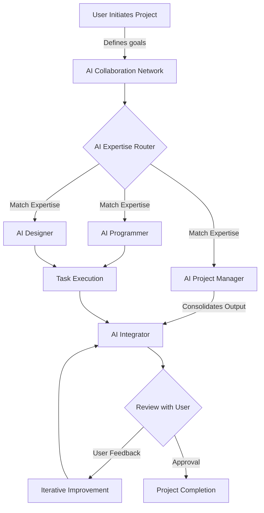

# The Problem

Current AI systems often operate in isolation, each designed to perform specific tasks without the ability to collaborate or understand context beyond their programmed capabilities. This leads to a disjointed experience where users must manually bridge the gap between different AI tools, integrate data, and interpret results to apply them effectively in real-world scenarios.

# Nexus

Imagine Nexus as a platform where AI agents with distinct abilities team up with humans. It's a space where AI actively participates in creative and decision-making processes, and humans steer these towards meaningful outcomes. This ecosystem enables a symbiotic relationship where AI contributes to creative processes, decision-making, and problem-solving, while humans guide and refine the outcomes based on their goals and values.

## **Core Components**

- **AI Collaboration Network** consisting of specialized AI agents.
- **Human-AI Interface** allowing intuitive interaction with AI.
- **Project Lifecycle Automation** for guiding projects from start to finish.
- **Decentralized Decision Support** to enable diverse input for better results.
- **Learning and Simulation Environment** for hands-on skill-building and testing.

## **Key Features**

- Access to a range of AI expertise as needed.
- Smooth integration of AI agents for a cohesive team effort.
- Conversational interface for natural communication with AI.
- Project templates that adapt and learn from user interaction.
- Continuous project analytics with AI-driven suggestions.
- Customized learning experiences tailored by AI to individual users.

### Possible user flow:

## Branching Strategy

- This is a widely-used branching strategy that defines a specific branching model for the project. It involves two main branches:
    - **`master`**: Represents the stable production-ready code.
    - **`develop`**: Serves as the main branch for ongoing development.
- Feature branches are created off the **`develop`** branch for developing new features. Once a feature is complete, it is merged back into **`develop`**.
- When the code in **`develop`** is ready for release, it is merged into the **`master`** branch, and a new release is tagged.
- Hotfixes for critical production issues are created from the **`master`** branch and then merged back into both **`master`** and **`develop`**.
        Have fun!", create a new line with “—-“and then type: -
        
